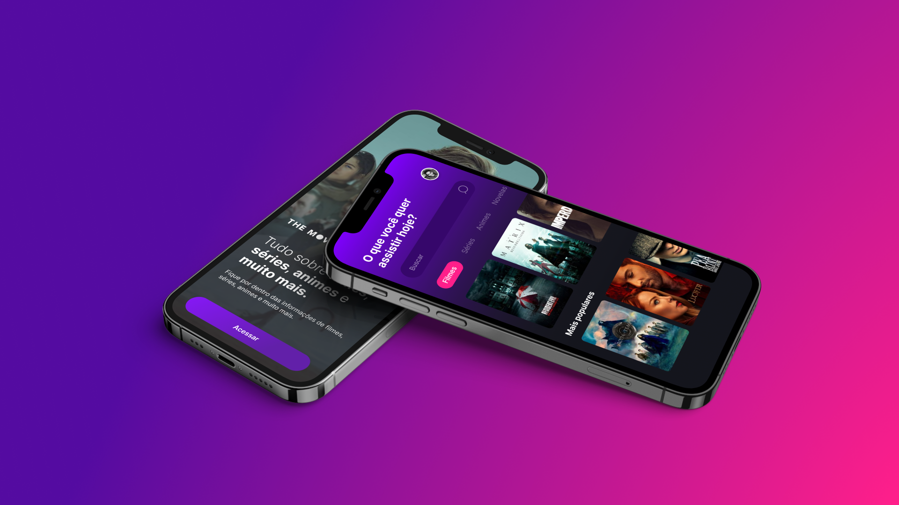

# App TMDB - Tutorial Flutter v[1.0]

Criando um aplicativo do zero utilizando Figma e Flutter.

# O que você vai aprender nesse tutorial

- Programar o frontend do app a partir de um layout feito no Figma;
- Consumir a API do TMDB para exibir informações e pesquisar os filmes;
- Como utilizar a biblioteca Modular;
- Criar Models, Store, Controllers e Views;
- Conceitos Básicos de Navegação
- Como utílizar a bilblioteca MOBx para auxiliar no gerenciamento de estado da
  aplicação.

## Atenção

Interface desenvolvida somente a título de estudo e sem fins comerciais.
